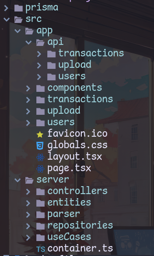

# Transactions File Uploader

This project is a web interface with a dedicated area for uploading a file that contains transactions of sold products/services made by creators and affiliates.

## Table of Contents
* Technical and architectural decisions
* Technologies Used
* Setup and Installation
* Implementation Details
* Tests
* Additional notes / Impovements

## Technical and architectural decisions
The development of this application prioritizes simplicity in:

- Modifying data persistence methods.
- Altering user interface types (GUI, CLI, CUI, etc.).
- Adding and optimizing features.

The application's main components – UI, API, business rules, and database – are meticulously decoupled to realize these priorities.


#### Change data persistency method or implementation.
The data layer is isolated following the repository pattern. We can change the data persistence method by implementing the interfaces `ITransactionRepository` and `IUserRepository`. We use dependency injection to pass which of the implementations the application is going to use. At the moment we have three possible implementations, each one designed for different environments (test, development, and production).

```
//container.ts

interface Container {
  transactionRepository: ITransactionRepository
  userRepository: IUserRepository;
}

const dev: Container = {
  transactionRepository: new TransactionRepositoryJSON(),
  userRepository: new UserRepositoryJSON()
}

const test: Container = {
  transactionRepository: new TransactionRepositoryInMemory(),
  userRepository: new UserRepositoryInMemory()
}

const prod: Container = {
  transactionRepository: new TransactionRepositoryPrismaMySQL(),
  userRepository: new UserRepositoryPrismaMySQL()
}

export function container(): Container {
  const mode = process.env.MODE || 'prod'

  switch (mode) {
    case 'dev':
      return dev
    case 'prod':
      return prod
    case 'test':
      return test
    default:
      throw new Error('Invalid mode')
  }
}
```

#### Change user interface
All the business rules are located in the src/server folder. 
We can easily choose to run the application with another interface such as CLI (Command Line Interface) or a CUI (Conversational user interface) like Chatbots, using the same core functionalities already implemented and carefully isolated.

#### Add and optimize features
As described, all the main parts of the application are isolated and independent from one another. Therefore, we can easily add and optimize features. Here are a few examples of this:
- **Optimization**: We can minimize the database queries by performing batch queries commonly known as transactions. To implement this we can create another implementation of the repository interface.
- **New feature**: We can add features to add, delete, and update individual transactions and users. These functionalities are called use cases on the application and to implement new ones we just need to make sure the repository interface has the methods we are going to need (if not, we can add them) for our purposes and correctly use it.

## Technologies Used
Technologies Used

* [Next.js](https://nextjs.org/): For building a fullstack application with high productivity.
* [Tailwind CSS](https://tailwindcss.com): Employed for styling the application, it allows rapid development of custom user interfaces with utility-first CSS classes, reducing the need for custom CSS. 
* [Prisma](https://www.prisma.io/): Utilized as the ORM for handling database operations, it provides a clear and concise way to define models and relationships, improving the development workflow.
* [Vitest](https://vitest.dev/): Used for testing the application, it offers a fast and scalable testing solution, ensuring the reliability and stability of the application. It has the exact same syntax as Jest and does not need extra configuration to deal with typescript.
* [Docker](https://www.docker.com/): Facilitates the development, shipping, and running of applications inside containers, ensuring consistency across multiple development and deployment environments.

## Setup and Instalation
1. **Clone the repository** (not needed if you already have the repository):

```
git clone https://github.com/BryanValeriano/upload-transaction.git
cd https://github.com/BryanValeriano/upload-transaction.git
```
2. **Build and Run Docker Containers**:

```
docker-compose up --build
```
3. **Database Migrations**:

```
//TO DO
```
4. **Access the Application**:

Open your web browser and navigate to ```http://localhost:3000``` to access the application.


## Implementation Details


The four main components of the application are:
- **API**: located on `src/app/api`
- **UI**: located on `src/app/`
- **Business logic**: located on `src/server/`
- **Data layer**: located on `src/server/repository`

Each API route endpoint calls one of the controllers.
- `POST` `/upload` calls `UploadTransactionFileController`
- `GET` `/transactions` calls `GetAllTransactionsController`
- `GET` `/users` calls `GetAllUsersController`

#### Transaction processing flow
1. Controllers receive references to repositories through dependency injection from API handlers and then call use cases.
2. `UploadTransactionFileController`, in special, receives from the API a base64 with all the transactions and calls the parser in `src/server/parser/base64toTransactionParser`.
3. After receiving the return from the parser, the controller checks if there are any errors and decides to return the error for the API or, in case there are no errors, process the transactions and return them instead.
4. To process the transaction the controllers calls the use case `ProcessTransactionService`.
5. `Process Transaction Service` has the main business rule logic related to how to update users' balances.
